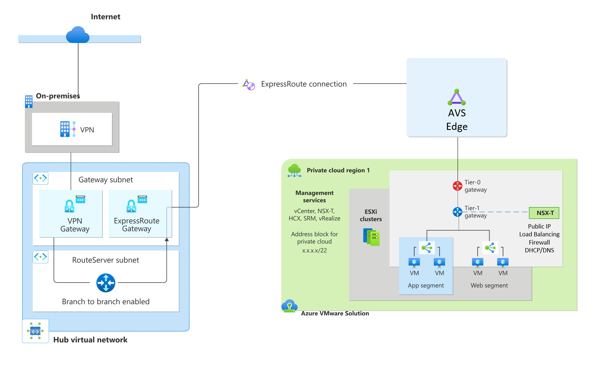
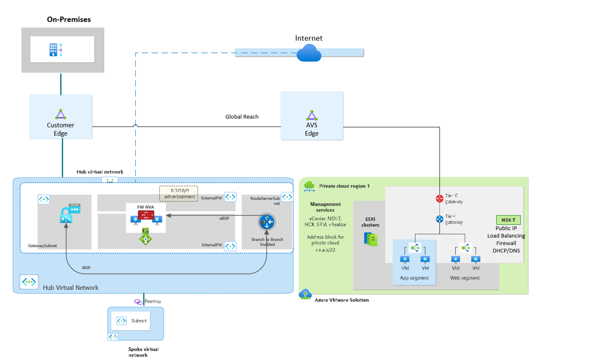
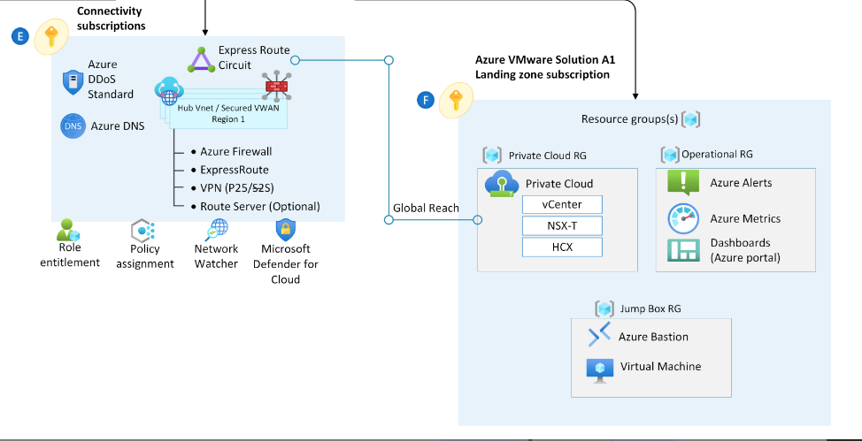

# Enable connectively from Azure VMware Solution using NSX-T or NVA (network virtual appliances)
## Introduction
In this design pattern, traffic has a dedicated path over the Microsoft backbone from the on-premises datacenter to the Azure VMware Solution (AVS) private cloud via the Expressroute Global Reach, a mechanism that supplies a direct path between the customer managed and the AVS dedicated Expressroute circuits. The private cloud also has a separate, isolated breakout from the NSX Edge to the internet so that this traffic does not traverse over the Expressroute.  

> [!IMPORTANT] If you’re in a region today where Global Reach is not supported, transit from on-premises to the AVS private cloud is possible by connecting to the Expressroute Gateway Azure. To supply the transitivity end-to-end, a virtual appliance in the Hub Virtual Network (VNET) is needed. Please see the section [Traffic Inspection & Default Route Advertisement below](vpn_egress.md#traffic-inspection). 

### Customer profile

This architecture is ideal for:
- Low latent, egress natively from the Azure VMware Solution SDDC (software-defined datacenters) to the internet.
- Direct traffic from on-premises directly to Azure via Expressroute or VPN.
- Inbound L4/L7 services for workloads in the SDDC such as HTTPS
 

The traffic, which flows through the AVS NSX routers, covered in this design include:

- Azure VMware Solution to Azure native virtual networks
- Azure VMware Solution to the internet 
-	Azure VMware Solution to on-premises datacenters 
 

### Architectural components

Implement this scenario with:

-	An NSX Distributed Firewall (DFW) – version 3.2.2 or higher
-	An NSX Advanced Load balancer 
-	Public IP for Internet breakout from Azure VMware Solution for both source and destination address translation (SNAT/DNAT)

> [!NOTE] While NSX Advanced load balancer (Avi) is recommended as the lowest latent choice, HTTPS is also possible with WAF/App Gateway v2 in Azure.

#### Key Decision

This document assumes and recommends default route advertisement from either on-premises or AVS. If you need the default route to originate from Azure, please see the section below

 
### Considerations 

-	Enable Public IP down to the NSX Edge in Azure Portal. This way allows for low-latency direct connections to Azure VMware Solution, and the ability to scale the number of outbound connections.
-	Leverage the NSX firewall for granular rule creation, URL filtering, and TLS Inspection.
-	Use the NSX Advanced load balancer to evenly distribute traffic to workloads.
-	Enable DDoS protection.

### Egress from AVS using NSX-T or NVA 

|  Traffic inspection coverage  | Recommended solution design | Considerations | Internet Breakout |
|----|---|---|---|
| - Internet ingress      - Internet egress   - Traffic to and on-premises datacenter   - Traffic to Azure Virtual Network   - Traffic within Azure VMware Solution  |   Use NSX-T or a third-party NVA firewall in Azure VMware Solution.     Use NSX-T Advanced Load Balancer for HTTPs, or NSX-T Firewall for non-HTTPs traffic.    Public IP for Internet breakout from Azure VMware Solution, SNAT, and DNAT. | Choose this option to advertise the `0.0.0.0/0` route from the Azure VMware Solution Private Cloud   Enable Public IP down to the NSX Edge in Azure Portal. This option allows for low-latency connections to Azure, and the ability to scale the number of outbound connections. | Azure VMWare Solution

###  Egress from Azure VMware Solution through 0.0.0.0/0 advertisement from on-premises
|  Traffic inspection coverage  | Recommended solution design | Considerations | Internet Breakout |
|----|---|---|---|
| - Internet ingress   - Internet egress   - To on-premises datacenter| Use a virtual appliance on-premises     For HTTP/S traffic, use NSX Advanced Loadbalancer or Application Gateway in Azure. For non-HTTP/S traffic, use the NSX Distributed Firewall.   Enable public IP in Azure VMware Solution. | Choose this option to advertise the `0.0.0.0/0` route from on-premises datacenters. | On-Premise

> [!IMPORTANT] Some traditional VMware appliances use service insertion to place appliances at the tier-0 router. The tier-0 routers are provisioned and managed by Microsoft and not consumable by end users. All network appliances and load balancers must be placed at tier-1. The next section discusses default route propagation from a party device in AVS. 
 
### Third Party NVA integration in AVS 
Integration with 3rd Party appliances is possible with careful consideration. In this design, NVA(s) sit behind one or more T-1 edge routers. 
 
The NVA is BYOL (Bring Your Own License). It is the consumers’ responsibility to bring a license and implement high availability for the NVA.
 
For NVA placement options and for information about the VMware limitation of up to eight virtual network interface cards (NICs) on a virtual machine see: https://github.com/Azure/Enterprise-Scale-for-AVS/tree/main/networking/nsx-firewall-patterns

> [!NOTE] Microsoft does not support the use of Mobility Optimized Networking when 3rd party NVAs are used.

## Landing Zone considerations
This section references best practices for integrating AVS with your Azure Landing Zone. 
### Azure Route Server
Azure route server (ARS) is used to dynamically propagate learned routes from AVS and supply Branch-to-Branch connectivity to VPN Gateways. VNET’s that are peered to the VNET where ARS lives will also dynamically learn routes. Use cases for Azure route server include:

Dynamic route propagation  
- Learn specific routes from AVS to local VNET’s via BGP (Border Gateway Protocol). Peered VNET’s will also learn the routes.
- Third Party NVA integration 
   - Peer ARS with NVA’s so that you don’t need UDR’s for each AVS segment to filter traffic.
   - Return traffic from peered VNET’s will need a UDR (User Defined Routes) back to the local interface of the firewall 
Transit mechanism from Expressroute to VPN Gateways
-	VPN Gateway must be of type Site-to-Site and configured in Active-Active 

To use Azure Route Server, please note the following:
-	Enable Branch to Branch
-	Route summarization for > 1000 routes or use NO_ADVERTISE BGP communities' flag Azure Route Server frequently asked questions (FAQs) | Microsoft Learn
-	Peering with NVA requires specific ASN’s. For example, since ARS uses 65515, no other appliance in the VNET can use that ASN (Autonomous System Number). 
-	No support for IPV6

## Inegration with Azure Netapp Files 

Azure Netapp Files (ANF) provides you with a Network Attached datastore. ANF lives in an Azure VNET and connects to workloads in AVS. 
- 	Must use ANF standard SKU
-  Deploy ANF in a delegated subnet 
- 	Hub & Spoke deployment supports ER GW SKU of up 10Gbps
-  Ultra & ErGw3AZ SKU is required for bypassing the gateway port speed limits
-  Read traffic will ingress and write traffic is egress over the Expressroute. Egress traffic over Expressroute circuits will bypass the gateway and go directly to the edge router 
-  Ingress/Egress charges are suppressed from AVS, however there is an egress charge if data is going across peered VNET’s. 
- Only NFS v3 is supported today. 
 
If you’re seeing unexpected latency, make sure your AVS Private cloud and ANF deployment are pinned to the same AZ (Azure Availability Zones). For high availability, create an ANF volumes in separate AZ’s and enable `Cross Zone Replication`

### VPN connectivity from On-Premises

While an Expressroute circuit is recommended, connecting to AVS from on-premises with IPSEC using a transit hub VNET in Azure is also possible. This will require a VPN gateway and Azure Route Server. As referenced earlier, Azure Route Server will enable transitivity between the VPN gateway and the AVS Expressroute gateway.

## Traffic Inspection 
As seen earlier, default route advertisement is happening from AVS with the Public IP down to the NSX Edge option, but it is also possible to continue advertising the default route from on-premises. End-to-end traffic filtering from on-premises to AVS is possible with the firewall placed at either of these endpoints. 

Default route advertisement from Azure is possible with 3rd party NVA in either a Hub VNET or when using Azure vWAN. In a Hub & Spoke deployment, Azure Firewall is not possible because it does not speak BGP, however use of a third party BGP capable device works. 

This scenario works for inspecting traffic from 
-	On premises to Azure
-	Azure to the internet
-	AVS to the internet 
-	AVS to Azure

## Additional Information 

-	 Access vCenter using Bastion + Jumpbox VM -   If you are accessing vCenter from on-premises, make sure to have a route from your on-premises networks to the /22 AVS management network that is not blocked by a firewall or routing policies. Test this method in cli by typing `Test-NetConnection  x.x.x.2 -port 443`
- DNS considerations -  If using private endpoints follow the guidance detailed here: Azure Private Endpoint DNS configuration | Microsoft Learn

## Next steps

- For more information on how to transit from On-premises VPN to Azure VMWare Solution, see the following [VPN to ExR transit how to article:](https://github.com/Azure/Enterprise-Scale-for-AVS/tree/main/BrownField/Networking/Step-By-Step-Guides/Hub%20VNET%20with%20VPN%20to%20ExpressRoute%20Gateway%20transit)
- For more information about Azure VMware Solution in hub-and-spoke networks, see [Integrate Azure VMware Solution in a hub and spoke architecture](/azure/azure-vmware/concepts-hub-and-spoke).
- For more information on VMware NSX-T Data Center network segments, see [Configure NSX-T Data Center network components using Azure VMware Solution](/azure/azure-vmware/configure-nsx-network-components-azure-portal#create-an-nsx-t-segment-in-the-azure-portal).
- For more information Azure Router Server, see the product overview [What is Azure Route Server?](/azure/route-server/overview)

Next, observe additional design patterns for establishing connectivity to the Azure VMware Solution

  > [!div class="nextstepaction"]
  > [Example Architectures for Azure VMware Solution](./example-architectures.md)
